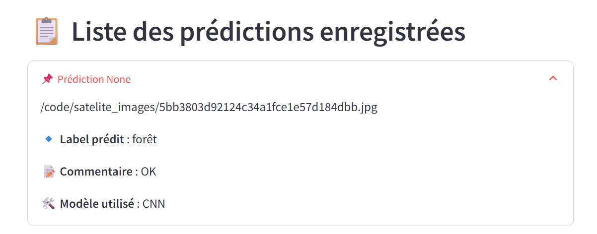

# Ticket d'incident 2

## Étapes pour reproduire le problème
1. Lancer l'application.
2. Ajouter une image satellite du désert sur la page *Upload image*.
3. *Envoyer*
4. Le *label* de la *prédiction* indique un *désert*.
5. Passer sur la page *Voir les prédictions*.
6. Dérouler la dernière prédiction de la *liste des prédictions enregistrées*.
7. Le *Label prédit* est *forêt*.

## Résultat actuel
Le label dans la *liste des prédictions enregistrées* n'est pas le bon; il affiche forêt à la place de désert.

## Comportement attendu
Le label prédit doit afficher désert.
