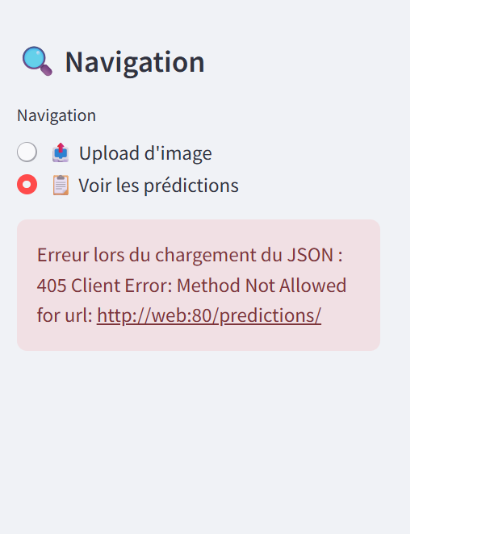

# Ticket d'incident 1

## Étapes pour reproduire le problème
1. Lancer l'application.

## Résultat actuel
La side bar affiche une erreur au lieu d'un bouton de téléchargement.

## Comportement attendu
La side bar affiche un bouton de téléchargement.
